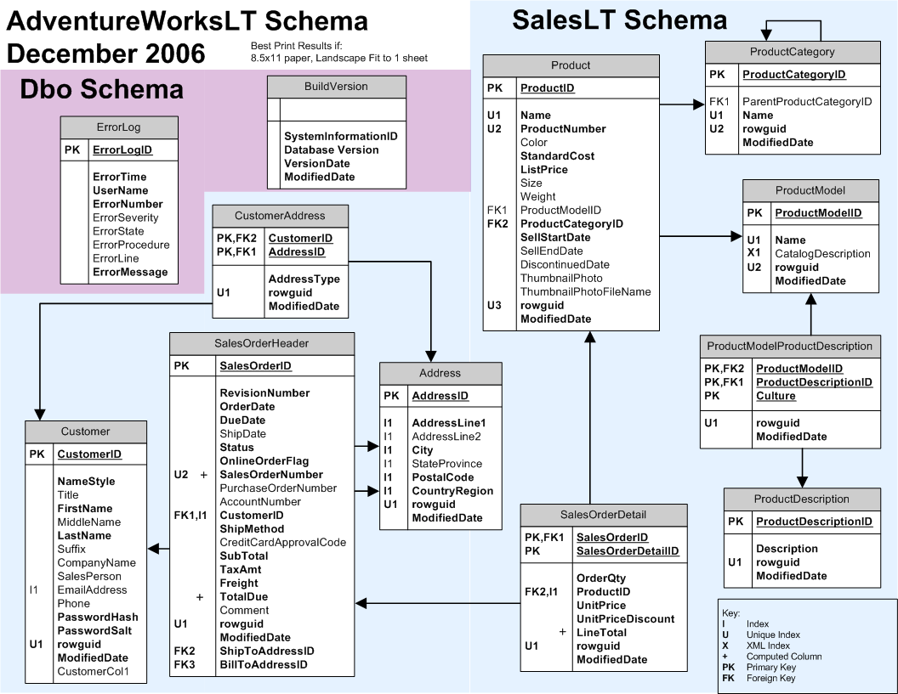

# AdventureWorks for SQLite

**This database inludes the following tables:**
- BuildVersion
- Address
- Customer
- CustomerAddress
- ErrorLog
- Product
- ProductCategory
- ProductModel
- ProductDescription
- ProductModelProductDescription
- SalesOrderDetail
- SalesOrderHeader

## Download:
AdventureWorks-sqlite.db

## How to Build
1. Install "SQLite" on windows
2. Edit the file CreateAdventureWorks.cmd, and change the path to "SQLite"
3. Run the file CreateAdventureWorks.cmd

## Note this is a fork from:
https://github.com/nuitsjp/AdventureWorks-for-SQLite

